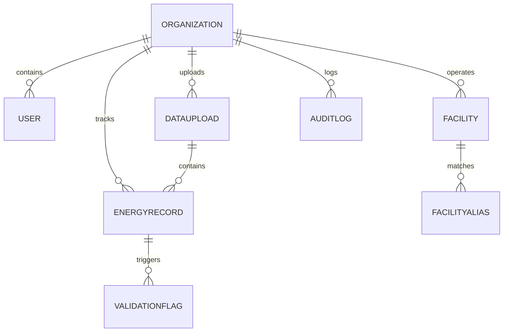

# Data Model & Architecture

I designed the database schema with a focus on strict multi-tenancy and data isolation, ensuring that one company can never access another company's ESG logs. Here is a breakdown of how the models are structured and why I created them.

---

## 1. Schema Architecture & Multi-Tenancy

### Organization
* **Why it exists**: It represents the highest-level tenant (e.g., "Acme Industries"). 
* **Why I created it**: Instead of relying on a simple text field or hoping different departments wouldn't see each other's files, I grouped all users, facilities, and records under this model.
* **The problem it solves**: Complete data security. All database queries on records and uploads filter on `organization_id` derived from the logged-in user's token.

### User
* **Why it exists**: Tracks individual account credentials and access permissions.
* **Why I created it**: I extended Django's default `AbstractUser` to add a direct foreign key to `Organization` and a `role` field (`ADMIN` or `ANALYST`).
* **The problem it solves**: Role-based access control. Analysts can upload and review records, but only admins have permission to approve/lock records and mapped facilities.

### Facility & FacilityAlias
* **Why they exist**: To link messy, raw codes from spreadsheet uploads to a clean, canonical physical location (like "HQ Bangalore").
* **Why I created them**: I realized that real-world spreadsheets never have consistent naming—one person writes "BLR-Office", another writes "Bangalore HQ". The `FacilityAlias` table stores these raw lookup strings and links them to the correct `Facility` ID.
* **The problem they solves**: The "dirty data" problem. Instead of rejecting uploads when names don't match exactly, the system marks the record with an `UNKNOWN_FACILITY` warning and lets the user map it on the fly.

### DataUpload
* **Why it exists**: Metadata tracking for each uploaded CSV/Excel spreadsheet.
* **Why I created it**: I needed a way to log who uploaded a specific spreadsheet, when it happened, and how clean the file was (average quality score).
* **The problem it solves**: Bulk tracking. If an analyst uploads the wrong file, we can trace all 20 records back to this single upload ID and delete or flag them together.

### EnergyRecord
* **Why it exists**: A single row of environmental consumption data (whether it is litres of fuel, kWh of electricity, or flight km).
* **Why I created it**: I decided to use a single table for all records rather than separate tables for Travel, Electricity, and Fuel. 
* **The problem it solves**: Simplified aggregation. By storing raw row data inside a PostgreSQL `JSONField` alongside normalized numerical fields, I can query a single table to render dashboard widgets for all three Scopes.

### ValidationFlag
* **Why it exists**: Individual diagnostic warnings or errors associated with a specific row.
* **Why I created it**: I wanted a system that doesn't just fail on bad data, but tells the analyst *exactly* what is wrong (e.g., "Distance cannot be negative" or "Date could not be parsed").
* **The problem it solves**: Error transparency. If a row has an `ERROR` flag, it is locked from being approved until the analyst corrects the file or edits it.

### AuditLog
* **Why it exists**: A tamper-proof history of every critical action taken on the system.
* **Why I created it**: Sustainability data is frequently audited. I needed to log who approved a record, who rejected it, what changed, and the reason they gave.
* **The problem it solves**: Compliance. It records "old value vs new value" for status updates and maps directly to the user who did it.

---

## 2. ESG Scope Categorization

I structured the records strictly based on Greenhouse Gas (GHG) Protocol scopes:

1. **Scope 1 (Direct Emissions)**: Captured via **SAP Fuel & Procurement** (combustion of diesel, natural gas, etc., directly owned by the company).
2. **Scope 2 (Indirect Emissions)**: Captured via **Utility Electricity** (purchased electricity used to power offices and factories).
3. **Scope 3 (Value Chain Emissions)**: Captured via **Corporate Travel** (indirect emissions from employee business flights and ground transport).

---

## 3. Data Normalization Strategy

* **Unit Normalization**: In `core/validation.py`, I built a mapping that converts messy units (e.g., `litres`, `L`, `liter`) to a standardized base (e.g., `L` for liquids, `kWh` for electricity, `km` for travel) and applies multipliers (like converting `MWh` to `kWh` or `miles` to `km`) so charts display accurate total sums.
* **Source Tracking**: Every single record keeps a reference to its `source_row` and its parent `DataUpload`. If a reviewer points to an anomaly in a chart, they can trace it back to the exact row in the original file.
